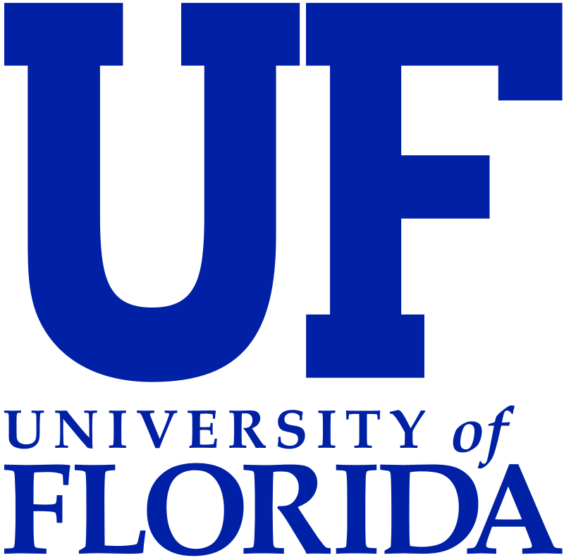
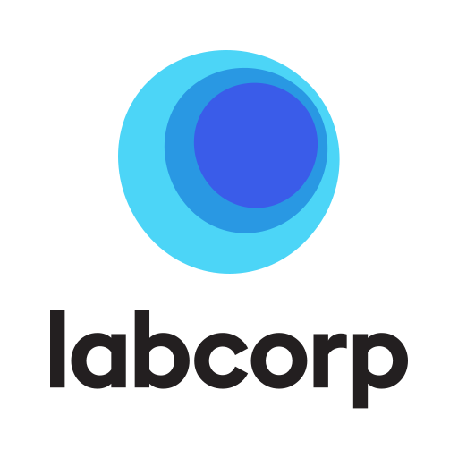
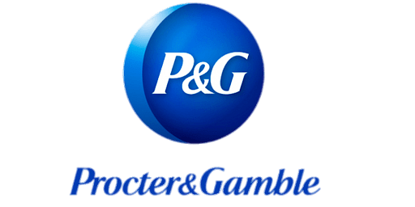

**Ellyse R Thomas**

AALAS-certified RLATG, LAT & ALAT  
Research Coordinator III  
UF College of Pharmacology and Therapeutics  
Gainesville, FL | May 2022-Present

**Contact:**

- Email: ellysethomas9 - at -  gmail - dot - com
- LinkedIn: [linkedin.com/in/ellysethomas](https://linkedin.com/in/ellysethomas)

## Professional Experience

### Research Coordinator III  

**UF College of Pharmacology and Therapeutics, Gainesville, FL | May 2022-Present**

{: .employer-logo}

- Drafted IACUC Protocols, research proposals, grant applications, and SOPs  
- Supervised laboratory staff and monitored research activities, ensuring compliance with AAALAC, USDA, OLAW, and CDC guidelines  
- Developed neuronal animal models for investigating olfactory system function  
- Managed rodent breeding colonies applying statistical justification of animal numbers

### Training & Education Coordinator  

**UF Animal Cares Services, Gainesville, FL | Feb 2021-May 2022**

{: .employer-logo}

- Designed rodent biomethodology curricula for online and in-person training  
- Instructed in-person species-specific injection, collection, and aseptic techniques  
- Established proficiency metrics and competency assessments  
- Formulated and reviewed institutional SOPs  
- Managed rodent colonies and determined end-point criteria

### Toxicology R&D Technician II  

**LabCorp/Covance, Madison, WI | Nov 2018-Feb 2021**

{: .employer-logo}

- M.S. Veterinary Sciences, Concentration: Forensic Toxicology, University of Florida  
- Collected, documented, and managed data for NHP and canine pre-clinical studies  
- Monitored animal health and welfare, ensuring compliance with AWA and AAALAC  
- Analyzed and interpreted data, producing comprehensive study reports for sponsors  
- Contributed as a board member on the Enrichment Committee

### Medical Device R&D Technician II  

**Georgia Institute of Technology/T3 labs, Atlanta, GA | Feb 2018-Nov 2018**

{: .employer-logo}

- Offered technical assistance to veterinarians in surgeries for ruminants, rodents, canines, and swine with novel medical device implants  
- Conducted animal husbandry and administration of post-opt medications  
- Collected blood, urine, and other biological samples  
- Regulated environmental conditions in animal housing facilities  
- Supervised cage wash and bio-hazardous material disposal

### Quality Control Chemist  

**Proctor and Gamble, Greensboro, NC | Jan 2016-Jul 2017**

{: .employer-logo}

- B.S. Biology | B.A. German, University of North Carolina Greensboro, Minor: Music Performance Viola  
- Tested and analyzed raw materials to ensure compliance with manufacturing standards and FDA regulations  
- Produced comprehensive investigation reports on QA/QC, OOS results, and CAPA following USP, NF, FCC, and P&G methods  
- Collaborated closely with receiving and operations teams to expedite testing and release of raw materials within specified timelines

## Skills

- Protocol/SOP writing  
- Stereotaxic surgery  
- Laboratory management and coordination  
- Laboratory inventory & ordering  
- Regulatory QA/QC audits  
- Laboratory equipment technical assistance  
- Immunohistochemistry  
- PCR genotyping  
- GLP/GMP standards  
- GC/LC instrumentation  
- Animal husbandry  
- Quality Control  
- Microsoft Office/Excel  
- Customer service  
- Adaptability  
- First Aid & CPR  
- Community Outreach

## Community Involvement

### Alachua County Animal Shelter

Volunteer

### Horsepower Therapeutic Riding Academy

Volunteer

### Greensboro Animal Shelter

Volunteer

## Front Desk Associate/Guest Services  

**Hampton Inn Greensboro Airport, Greensboro, NC | Apr 2008-Feb 2016**

- Alpha Delta Pi Society  
- Delta Phi Alpha German Honors Society  
- Lloyd International Honors College  
- Managed daily guest check-ins, special requests, and other customer service duties  
- Handled group reservations and meeting room sales during conferences and expos  
- Conducted new employee training on front-desk operations and procedures

[Back to home page](../index)